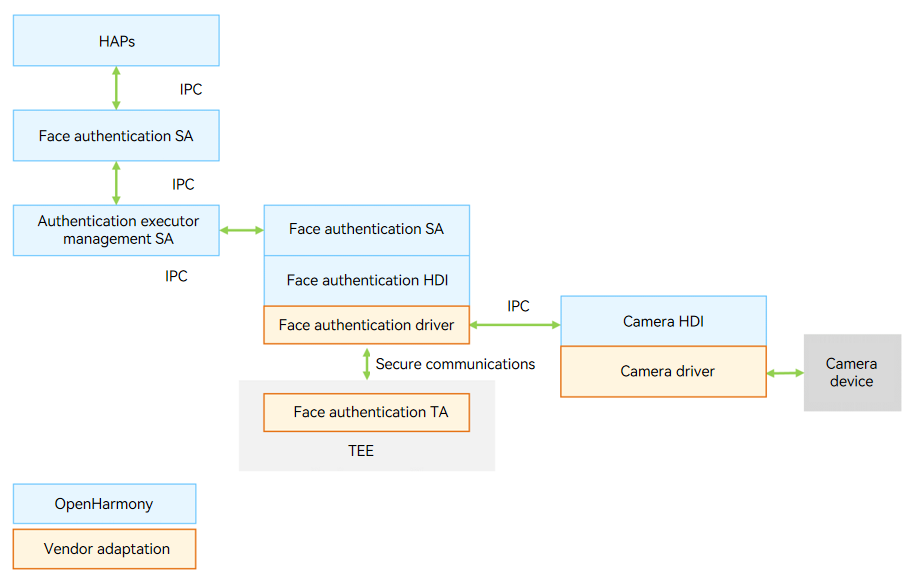

# Face Authentication

## Introduction

Face authentication (faceauth) supports enrollment, deletion, and authentication of user faces.

faceauth is a biometric authentication executor supported by OpenHarmony. It registers face authentication resource information with the collaborative authentication framework through the interface defined by collaborative authentication. The collaborative authentication framework calls faceauth HDI interfaces to enroll or delete facial credentials and perform face authentication.

**Figure 1** Face authentication architecture



Facial data is important biometric information of users. The following security measures are taken to protect the facial data during the authentication process:

1. Permission management: High-level permissions are defined for face enrollment and deletion APIs, which can be called only by system applications.
1. Secure storage and comparison of facial data: The faceauth HDI provides adaptation interfaces for device vendors. Device vendors can implement secure facial data comparison and storage in a trusted execution environment (TEE). 

> **NOTE**
>
>  The OpenHarmony open-source framework provides stub implementation for face authentication, but does not include secure storage and comparison of face data in a TEE.

# Directory Structure

```
//base/useriam/face_auth
├── bundle.json            # Module description file
├── common                 # Common files
├── figures                # Figures used in the README
├── frameworks             # Framework code
├── interfaces             # External APIs
│   └── inner_api          # Header file exposed to internal subsystems for system services
├── sa_profile             # Service ability profile 
├── services               # Service ability implementation
└── ui                     # User interface for face enrollment
```

## Usage

Device vendors need to implement the APIs defined in the IDL file **//drivers/interface/faceauth**. This IDL file provides stub implementation of APIs. The extraction, comparison, storage, and enrollment of facial data must be implemented in a secure environment (TEE or secure chipset) to ensure the highest security level in the system.

## Repositories Involved

[useriam_user_auth_framework](https://gitee.com/openharmony/useriam_user_auth_framework)

[useriam_pin_auth](https://gitee.com/openharmony/useriam_pin_auth)

**[useriam_face_auth](https://gitee.com/openharmony/useriam_face_auth)**

[drivers_interface](https://gitee.com/openharmony/drivers_interface)

[drivers_peripheral](https://gitee.com/openharmony/drivers_peripheral)
